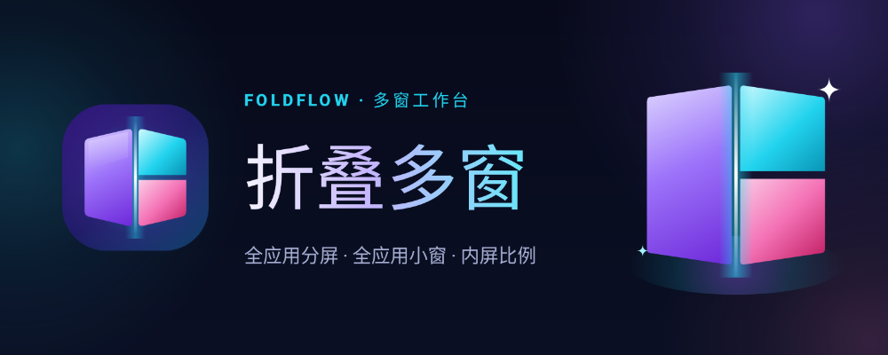
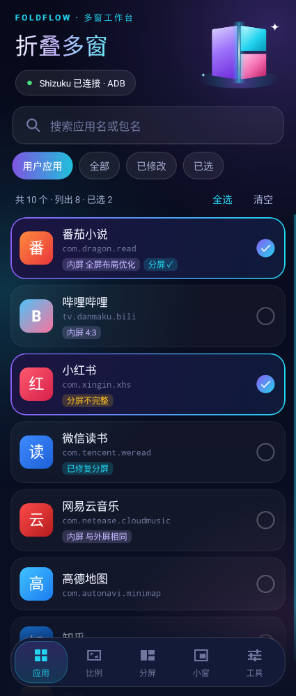
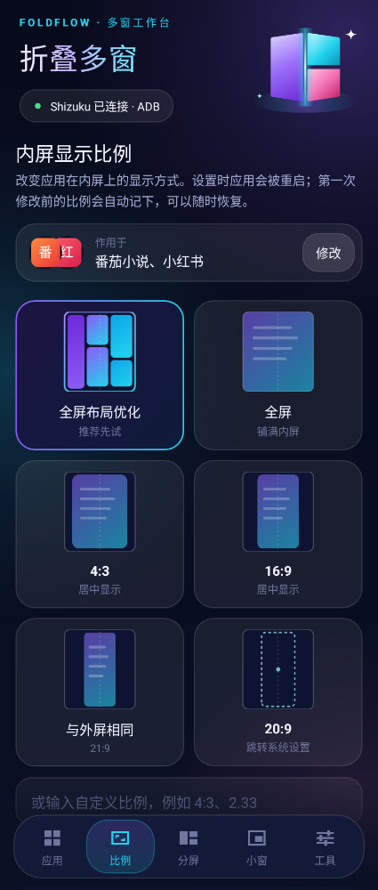
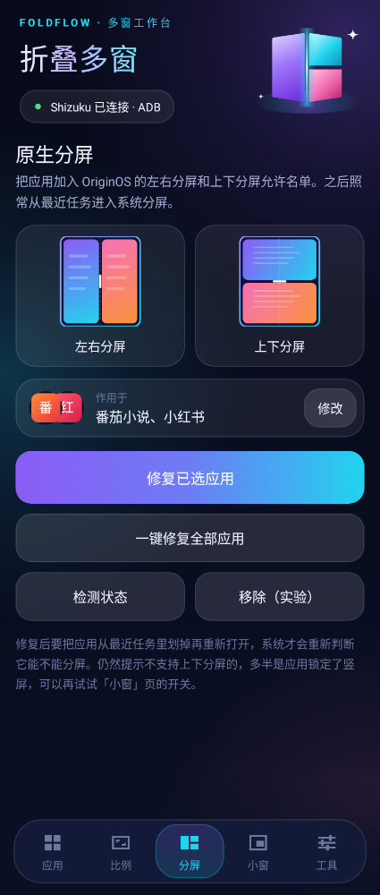
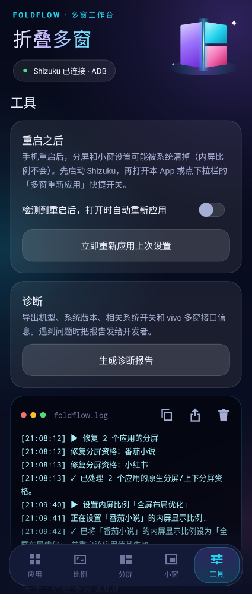
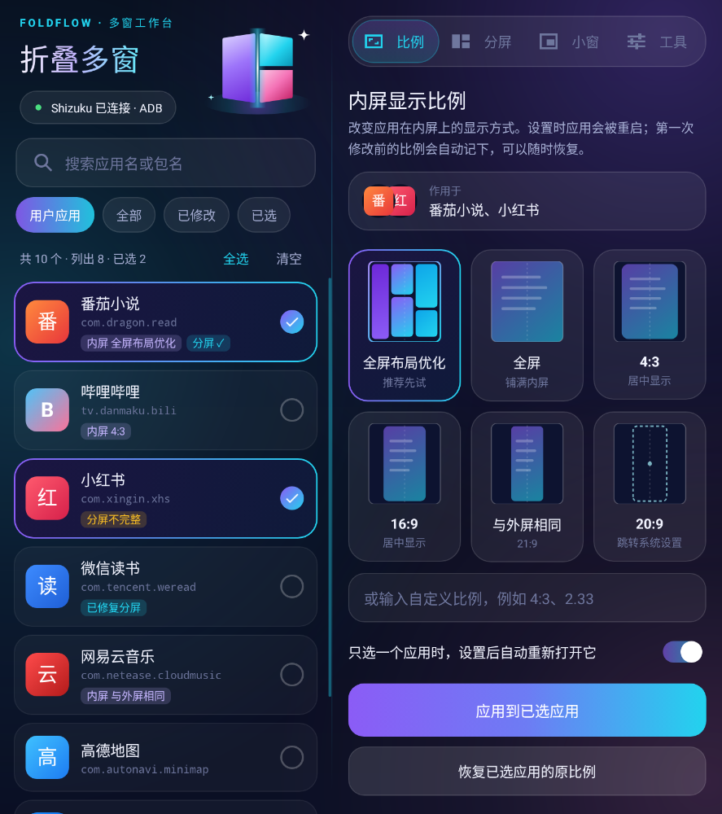
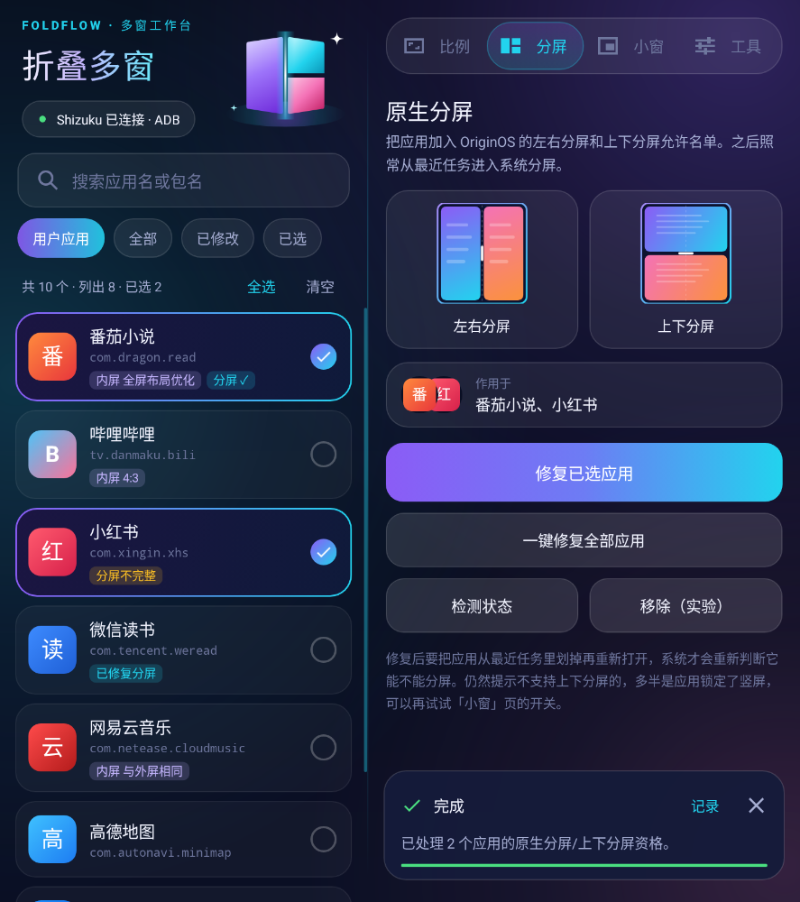

<p align="center">
  
</p>

# 折叠多窗 FoldFlow

给 vivo 折叠屏（OriginOS）用的多窗工具。通过 [Shizuku](https://shizuku.rikka.app/) 获得系统权限，把系统自带的分屏、小窗开放给原本被挡在外面的应用，并可调整应用在内屏的显示比例。

它不自己做分屏或小窗，而是把应用加进 OriginOS 的允许名单，之后仍然用系统原生的入口（最近任务 → 分屏 / 小窗）。

## 截图

外屏（单栏 + 底部导航）：

<p>
  
  
  
  
</p>

内屏展开（左侧应用列表常驻，右侧操作区）：

<p>
  
  
</p>

> 截图由 [Paparazzi](https://github.com/cashapp/paparazzi) 在电脑上按 X Fold3 外屏 / 内屏尺寸渲染，列表里是示例数据。

## 功能

- **应用列表**：可搜索、多选，按用户应用 / 全部 / 已修改 / 已选筛选；每个应用显示当前内屏比例和分屏状态
- **内屏显示比例**：全屏布局优化、全屏、4:3、16:9、与外屏相同（21:9），卡片上直接画出每种比例在内屏上的样子；可批量设置；自动记录修改前的比例，随时一键恢复
- **原生分屏**：把应用加入 OriginOS 左右分屏 + 上下分屏允许名单；检测分屏状态；移除（实验，依赖固件提供移除命令）
- **全应用小窗**：打开系统小窗相关开关并把所有应用加入小窗允许名单；首次开启前自动备份开关，可一键还原
- **重启后重新应用**：通过开机次数检测手机是否重启过，提示或自动重新应用；另有下拉栏快捷开关「多窗重新应用」
- **诊断报告**：导出机型、系统版本、相关开关当前值、splitconfig 帮助、vivo 多窗接口签名，便于排查
- **为折叠屏设计**：外屏是单栏 + 底部导航，展开内屏自动切换成左右双栏；开合手机时界面无缝切换，正在执行的操作不会中断

## 适用范围

- 依赖 vivo OriginOS 私有接口（`cmd activity splitconfig`、`VivoFreeformManager`、`fold_inner_screen_ratio_modified_by_user`），**只适用于 vivo 设备**，主要面向 X Fold 系列；其他品牌上这些功能会直接报错，不会造成改动
- Android 12 及以上
- 需要 Shizuku（ADB 或 Root 模式）

## 安装与使用

1. 在 [Releases](https://github.com/rsliyu/foldsplit-plus/releases) 下载最新 APK 安装
2. 安装并启动 Shizuku
3. 打开「折叠多窗」，点顶部的 Shizuku 状态完成授权
4. 在「应用」页勾选应用，再到「比例 / 分屏 / 小窗」页执行操作
5. 手机重启后先启动 Shizuku，再打开本 App 或点下拉栏快捷开关重新应用（内屏比例保存在系统设置里，重启不会丢）

### 从 2.x（折叠屏分屏助手 Plus）升级

3.0 起包名改为 `io.github.rsliyu.foldflow`，不会覆盖安装旧版，两个版本可以同时存在。
「恢复原比例」「还原系统小窗开关」依赖的备份记录保存在旧版里。如果用 2.x 改过内屏比例或开过全应用小窗，想恢复的话请先在旧版里恢复，再卸载旧版。

## 编译

需要 JDK 21 和 Android SDK（compileSdk 35）。

```bash
# local.properties 里写 sdk.dir=<Android SDK 路径>
./gradlew assembleRelease

# 界面截图：重新生成 / 与已有截图比对
./gradlew :app:recordPaparazziDebug
./gradlew :app:verifyPaparazziDebug
```

发布签名从 `keystore/keystore.properties` 读取（不在仓库中），文件格式：

```properties
storeFile=foldsplit-plus.jks
storePassword=...
keyAlias=foldsplit
keyPassword=...
```

没有这个文件时 release 构建不带签名，可以改用 `./gradlew assembleDebug`。

## 代码结构

| 文件 | 作用 |
|---|---|
| `PrivilegedShellService` | 在 Shizuku 拉起的 shell 身份进程里执行命令、反射调用 vivo 系统接口、读写 Secure 设置 |
| `ShizukuShell` | App 进程侧，绑定 Shizuku UserService 并转发调用 |
| `FoldOps` | 所有多窗操作的同步实现，界面和快捷开关共用 |
| `InnerRatioConfig` | 内屏比例配置字符串（`:包名,比例:` 格式）的解析与改写 |
| `Store` | 本地记录：开关备份、修改过的应用、原比例、上次应用时的开机次数 |
| `MainActivity` | 持有界面状态和后台任务；开合手机时只换布局，不重建 Activity |
| `UiState` / `MainScreen` | 界面状态，以及把状态渲染到单栏或双栏布局 |
| `FoldHeroView` / `DiagramView` / `GlowProgressView` / `StatusDotView` | 自绘控件：折叠屏动画插画、比例与分屏示意图、流光进度条、状态灯 |
| `ReapplyTileService` | 下拉栏快捷开关 |

## 致谢

底层的 vivo 接口调用参考了「折叠屏分屏助手」App。

## 🔗 交流社区

感谢 [LINUX DO 社区](https://linux.do/) 提供的交流空间，也欢迎分享你的使用体验与建议。
